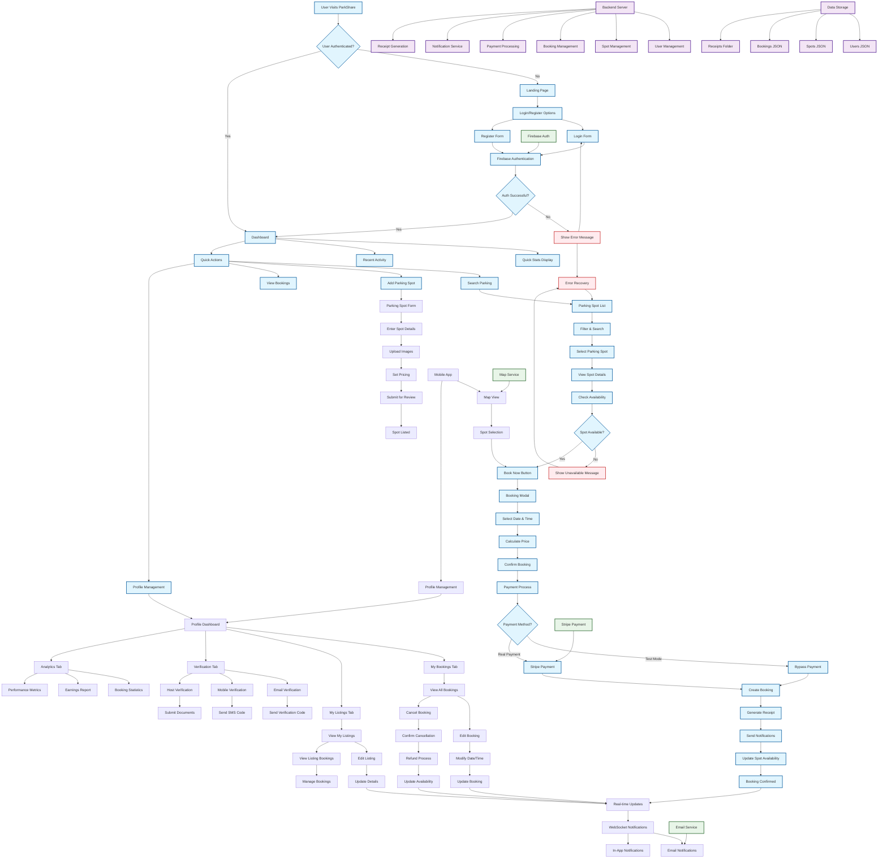

# ParkShare Application Flowchart

## 🚗 Complete System Architecture & User Journey



## 📋 Detailed Process Breakdown

### 1. **User Authentication Flow**
```
User Entry → Landing Page → Login/Register → Firebase Auth → Dashboard
```

### 2. **Parking Spot Search & Booking**
```
Search → Filter Results → Select Spot → Check Availability → Book → Payment → Confirmation
```

### 3. **Host Management Flow**
```
Add Spot → Fill Details → Upload Images → Set Pricing → Submit → Listing Active
```

### 4. **Booking Management**
```
View Bookings → Edit/Cancel → Confirm Changes → Update System → Notifications
```

### 5. **Profile & Analytics**
```
Profile Dashboard → Stats Overview → Quick Actions → Detailed Analytics → Performance Metrics
```

## 🔄 Real-time Features

### WebSocket Connections
- **Spot Availability Updates**: Real-time availability changes
- **Booking Notifications**: Instant booking confirmations
- **Payment Status**: Live payment processing updates
- **Host Notifications**: Booking requests and cancellations

### Notification System
- **In-App Notifications**: Real-time updates in notification center
- **Email Notifications**: Booking confirmations and receipts
- **SMS Notifications**: Verification codes and alerts

## 💳 Payment Processing

### Test Mode
```
Booking → Test Mode Check → Bypass Payment → Create Booking → Generate Receipt
```

### Production Mode
```
Booking → Stripe Payment Intent → Payment Processing → Verification → Create Booking → Transfer to Host
```

## 📊 Data Management

### File-based Storage
- **users.json**: User profiles and authentication data
- **spots.json**: Parking spot listings and availability
- **bookings.json**: Booking records and status
- **receipts/**: Generated PDF receipts

### Real-time Updates
- **Spot Availability**: Immediate updates when booked/cancelled
- **Booking Status**: Live status changes
- **User Notifications**: Instant notification delivery

## 🔐 Security & Verification

### User Verification
- **Email Verification**: Send verification codes
- **Mobile Verification**: SMS verification codes
- **Host Verification**: Document submission and review

### Payment Security
- **Stripe Integration**: Secure payment processing
- **Test Mode**: Safe testing environment
- **Receipt Generation**: Secure transaction records

## 📱 Mobile App Integration

### Cross-Platform Features
- **Map View**: Interactive parking spot locations
- **Booking Management**: Full booking capabilities
- **Profile Access**: Complete profile management
- **Real-time Updates**: Same real-time features as web

## 🚀 Key Features Summary

### For Users (Renters)
- ✅ Search and filter parking spots
- ✅ Real-time availability checking
- ✅ Secure booking and payment
- ✅ Booking management (edit/cancel)
- ✅ Receipt generation
- ✅ Profile management
- ✅ Analytics and statistics

### For Hosts (Spot Owners)
- ✅ Add and manage parking spots
- ✅ Set pricing and availability
- ✅ View booking requests
- ✅ Manage spot bookings
- ✅ Earnings tracking
- ✅ Host verification
- ✅ Performance analytics

### System Features
- ✅ Real-time updates via WebSocket
- ✅ Secure authentication with Firebase
- ✅ Payment processing with Stripe
- ✅ Email and SMS notifications
- ✅ Receipt generation service
- ✅ Mobile app support
- ✅ Comprehensive error handling

## 🔧 Technical Architecture

### Frontend (React)
- **Components**: Modular, reusable UI components
- **Context**: Global state management
- **Routing**: React Router for navigation
- **Styling**: Material-UI for consistent design

### Backend (Node.js)
- **Express Server**: RESTful API endpoints
- **WebSocket**: Real-time communication
- **File System**: JSON-based data storage
- **Services**: Payment, notification, receipt generation

### External Services
- **Firebase**: Authentication and user management
- **Stripe**: Payment processing
- **Email Service**: Transactional emails
- **Map Service**: Location and mapping

This flowchart represents the complete ParkShare ecosystem, showing how users interact with the system, how data flows between components, and how the various services work together to provide a seamless parking spot sharing experience. 