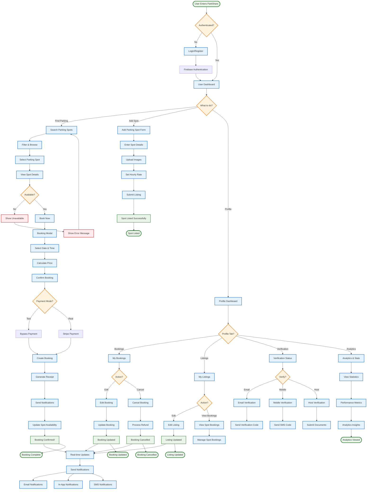

# ParkShare - Simplified User Journey Flowchart

## 🚗 Main User Flows



## 📋 Core User Journeys

### 1. **Renter Journey** (Find & Book Parking)
```
Dashboard → Search Spots → Select Spot → Book → Payment → Confirmation
```

### 2. **Host Journey** (List Parking Spot)
```
Dashboard → Add Spot → Fill Details → Set Price → Submit → Listed
```

### 3. **Profile Management Journey**
```
Dashboard → Profile → Choose Tab → Manage Content → Updates
```

### 4. **Booking Management Journey**
```
Profile → My Bookings → Edit/Cancel → Confirm → System Update
```

## 🔄 Key System Interactions

### Real-time Features
- **WebSocket Updates**: Instant availability changes
- **Live Notifications**: Real-time booking alerts
- **Payment Status**: Live payment processing
- **Spot Management**: Immediate listing updates

### Data Flow
- **Frontend**: React components with Material-UI
- **Backend**: Node.js with Express and WebSocket
- **Database**: JSON files (users, spots, bookings)
- **External**: Firebase Auth, Stripe Payments

### Security & Verification
- **Authentication**: Firebase secure login
- **Payments**: Stripe secure processing
- **Verification**: Email, SMS, and document verification
- **Receipts**: Secure PDF generation

## 🎯 Main Features Summary

### For Renters
- 🔍 Search and filter parking spots
- 📅 Book with date/time selection
- 💳 Secure payment processing
- 📱 Real-time notifications
- 📊 Booking management
- 📄 Receipt generation

### For Hosts
- ➕ Add parking spot listings
- 💰 Set pricing and availability
- 📈 View booking analytics
- ✅ Host verification process
- 📱 Manage spot bookings
- 💵 Track earnings

### System Features
- ⚡ Real-time updates
- 🔐 Secure authentication
- 💳 Payment processing
- 📧 Email notifications
- 📱 Mobile app support
- 📊 Analytics dashboard

This simplified flowchart shows the main user journeys and core functionality of ParkShare, making it easy to understand how users interact with the system and how different features work together. 